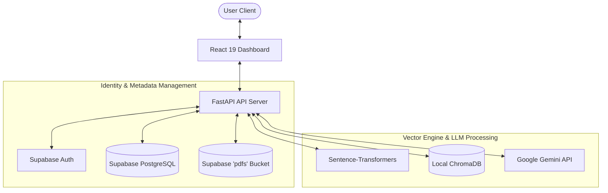

# AI Knowledge Base Search using Retrieval-Augmented Generation (RAG)

An enterprise-ready, full-stack AI application for indexing, segmenting, vector-hashing, and chatting with PDF document pools using Retrieval-Augmented Generation (RAG).

The system splits PDFs page-by-page, generates semantic vector hashes locally using a Sentence-Transformer model, indexes them in a persistent ChromaDB store, retrieves matching segments during user query, and feeds citations and histories to Google Gemini API to construct answers strictly restricted to the uploaded documents.

---

## Technical Stack

### Frontend
- **React 19 & Vite** – Fast, lightweight client framework
- **TypeScript** – Static structural types
- **Tailwind CSS** – Curated dark theme palette
- **React Router & React Query** – Navigation routing and cache syncing
- **Axios** – HTTP connection client with session expiry interceptors
- **Framer Motion** – Micro-animations
- **Lucide Icons** – Clean glyph icons

### Backend
- **FastAPI & Uvicorn** – High-performance asynchronous API server
- **Sentence-Transformers** – Local embeddings (`sentence-transformers/all-MiniLM-L6-v2`)
- **ChromaDB** – In-process vector index storage with user & file metadata filters
- **Google Gemini API** – Generative AI answer synthesis
- **PyPDF** – PDF text parsing engine
- **LangChain Splitters** – Recursive character-based tokenizer (Chunk Size = 1000, Overlap = 200)

### Database
- **Supabase** – DB storage (auth, metadata tables, chats, and objects bucket for source PDFs)

---

## System Architecture



---

## Folder Structure

```
root/
├── frontend/                 # React 19 + TypeScript Application
│   ├── src/
│   │   ├── components/       # Reusable layout guards
│   │   ├── hooks/            # Global contexts (Auth)
│   │   ├── layouts/          # Left-sidebar frames
│   │   ├── pages/            # Core views (Landing, Chat, Dashboard)
│   │   ├── services/         # Axios API clients
│   │   └── types/            # TypeScript Interface definitions
│   ├── index.html            # Main site frame
│   ├── tailwind.config.js    # Custom brand styles
│   └── vite.config.ts        # Vite client configuration
│
├── backend/                  # FastAPI Application
│   ├── app/
│   │   ├── api/endpoints/    # API routes (Auth, Documents, Chat, Dashboard)
│   │   ├── core/             # Settings, logging, security modules
│   │   ├── database/         # Supabase connection managers
│   │   ├── embeddings/       # Local Sentence-Transformers wrapper
│   │   ├── services/         # PDF processing, chunking, Gemini services
│   │   ├── vectorstore/      # ChromaDB vector index CRUD controllers
│   │   └── main.py           # Application lifespan manager
│   ├── tests/                # Automated pytest modules
│   └── requirements.txt      # Python dependencies
│
├── supabase/
│   └── schema.sql            # Database tables, triggers, and bucket policies
├── uploads/                  # Local PDF download caching
├── chroma_db/                # Local Chroma DB persistent volumes
├── Dockerfile                # Multi-stage python build
├── docker-compose.yml        # Orchestration profile
└── .env.example              # Key environment variables
```

---

## Environment Variables

Create a `.env` file at the project root matching `.env.example`:

```env
SUPABASE_URL=https://your-project-id.supabase.co
SUPABASE_ANON_KEY=your-anon-api-key
SUPABASE_SERVICE_ROLE_KEY=your-service-role-key
GOOGLE_API_KEY=your-google-gemini-api-key
SECRET_KEY=secure-jwt-signing-salt
CHROMA_DB_PATH=./chroma_db
UPLOAD_FOLDER=./uploads
```

---

## Supabase Database Setup

1. Create a project at [Supabase](https://supabase.com/).
2. Navigate to **SQL Editor** in your Supabase dashboard.
3. Paste the contents of [supabase/schema.sql](file:///g:/RAG%20Project/supabase/schema.sql) and click **Run**.
   - This sets up the `documents`, `conversations`, and `messages` tables.
   - It configures Row Level Security (RLS) policies linking records to `auth.uid()`.
   - It provisions the private storage bucket `pdfs` with read/write access limited to file owners.

---

## Installation & Deployment

### Method A: Running via Docker Compose (Recommended)
This spins up the backend server (port 8000) and frontend development client (port 5173) together.

1. Ensure Docker and Docker Compose are installed.
2. Build and launch containers:
   ```bash
   docker-compose up --build
   ```
3. Open `http://localhost:5173` in your browser.

---

### Method B: Manual Manual Launch

#### 1. Running the FastAPI Backend
1. Ensure Python 3.11+ is installed.
2. Navigate to the backend folder:
   ```bash
   cd backend
   ```
3. Create and activate a virtual environment:
   ```bash
   python -m venv venv
   # On Windows:
   .\venv\Scripts\activate
   # On macOS/Linux:
   source venv/bin/activate
   ```
4. Install dependencies:
   ```bash
   pip install -r requirements.txt
   ```
5. Launch the development server:
   ```bash
   uvicorn app.main:app --reload --host 0.0.0.0 --port 8000
   ```
   - Swagger Documentation will be accessible at: `http://localhost:8000/docs`.
   - Logs will be recorded to `logs/app.log`.

#### 2. Running the React Frontend
1. Open a new terminal.
2. Navigate to the frontend folder:
   ```bash
   cd frontend
   ```
3. Install dependencies:
   ```bash
   npm install
   ```
4. Start the dev server:
   ```bash
   npm run dev
   ```
5. Open `http://localhost:5173` in your browser.

---

## Testing Suite

The project includes automated PyTest units covering text extraction, sentence segmentation, 384-dimensional vector verification, and Gemini prompt instruction matching.

To run tests:
1. Activate your Python virtual environment inside the `backend` folder.
2. Execute:
   ```bash
   pytest
   ```

---

## API Documentation Summary

- **Authentication**
  - `POST /auth/signup` – Register a new account
  - `POST /auth/login` – Login & receive JWT session
  - `POST /auth/forgot-password` – Trigger password recovery email
- **Document Management**
  - `POST /documents/upload` – Upload a PDF file
  - `GET /documents` – Retrieve user uploaded PDF metadata
  - `POST /documents/process` – Extract, chunk, embed, and index a PDF file (Async background task)
  - `DELETE /documents/{id}` – Delete metadata, cached files, storage objects, and ChromaDB vector keys
- **Chat Engine**
  - `POST /chat` – Submit query, retrieve local context, query Gemini, log answer with sources
  - `GET /chat/conversations` – List chat threads
  - `GET /chat/history/{id}` – Fetch messages from thread
  - `DELETE /chat/{id}` – Cascade delete a chat thread
  - `POST /chat/message/feedback` – Upvote or downvote assistant responses
- **Dashboard**
  - `GET /dashboard` – Fetch analytics summary metrics
- **Health Checks**
  - `GET /health` – Query backend service statuses

---

## License

Distributed under the MIT License. See [LICENSE](file:///g:/RAG%20Project/LICENSE) for more information.
